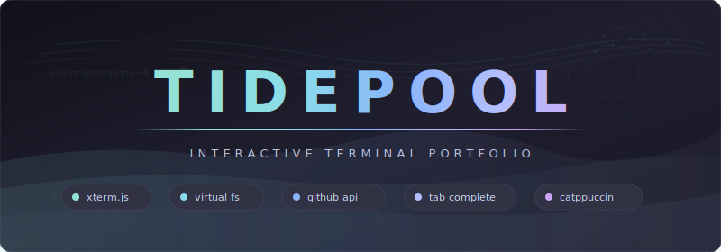

<div align="center">



An interactive terminal portfolio website built with xterm.js. Visitors explore your developer profile by typing real shell commands in a browser-based terminal emulator.

</div>

---

## Table of Contents

- [Highlights](#highlights)
- [Quick Start](#quick-start)
- [Usage](#usage)
- [Command Reference](#command-reference)
- [Architecture](#architecture)
- [Tech Stack](#tech-stack)
- [Features](#features)
- [Development](#development)
- [Deployment](#deployment)
- [Troubleshooting](#troubleshooting)

---

## Highlights

<table>
<tr>
<td width="50%">

### Real Terminal
Full xterm.js terminal emulation with cursor movement, line editing, and ANSI 24-bit color rendering.

</td>
<td width="50%">

### Virtual Filesystem
Navigate directories, read files, and discover content through a fully simulated Unix filesystem.

</td>
</tr>
<tr>
<td>

### Live GitHub Data
Repository stats, languages, and profile info fetched daily via GitHub Actions and displayed in real time.

</td>
<td>

### Catppuccin Mocha
Full Catppuccin Mocha palette applied across the terminal, prompt, command output, and UI elements.

</td>
</tr>
<tr>
<td>

### Shell Features
Tab completion for commands and paths, command history with arrow keys, Home/End navigation, and Ctrl shortcuts.

</td>
<td>

### Mobile Support
Responsive layout with a keyboard toggle button for touch devices and viewport-aware resizing.

</td>
</tr>
<tr>
<td>

### Boot Sequence
Simulated BIOS and kernel boot animation with ASCII art logo. Skippable with any keypress.

</td>
<td>

### Permalinks
Share direct links to commands via URL hash. Visiting `#neofetch` auto-runs the command on load.

</td>
</tr>
</table>

---

## Quick Start

### Prerequisites

| Dependency | Version |
|------------|---------|
| Node.js | 20+ |
| npm | any |

### Install & Run

```sh
# Install dependencies
npm install

# Start dev server
npm run dev
```

Open `http://localhost:5173` in your browser.

---

## Usage

**Type commands in the terminal:**

```sh
visitor@real-fruit-snacks:~ $ help          # list all commands
visitor@real-fruit-snacks:~ $ neofetch      # system info display
visitor@real-fruit-snacks:~ $ repos         # browse GitHub repositories
visitor@real-fruit-snacks:~ $ ls            # list files
visitor@real-fruit-snacks:~ $ cat about.md  # read a file
visitor@real-fruit-snacks:~ $ cd projects   # navigate directories
visitor@real-fruit-snacks:~ $ skills        # skill bars with progress
```

**Keyboard shortcuts:**

| Shortcut | Action |
|----------|--------|
| `Tab` | Autocomplete commands and file paths |
| `Up/Down` | Browse command history |
| `Home/End` | Jump to start/end of line |
| `Ctrl+C` | Cancel current input |
| `Ctrl+L` | Clear screen |
| `Ctrl+U` | Clear line |

---

## Command Reference

| Command | Aliases | Category | Description |
|---------|---------|----------|-------------|
| `help` | `?` | General | Show available commands |
| `clear` | `cls` | General | Clear the terminal |
| `history` | — | General | Show command history |
| `pwd` | — | Navigation | Print working directory |
| `cd` | — | Navigation | Change directory |
| `ls` | `dir`, `ll` | Navigation | List directory contents |
| `cat` | `less`, `more` | Navigation | Display file contents |
| `whoami` | — | Info | Display current user |
| `about` | — | Info | About me |
| `contact` | `email`, `socials` | Info | Contact information |
| `resume` | `cv` | Info | View my resume |
| `skills` | `tech`, `stack` | Info | Technical skills with progress bars |
| `repos` | `projects` | GitHub | GitHub repositories table |
| `neofetch` | `fetch` | Info | System info display with ASCII art |

---

## Architecture

### Project Structure

```
src/
  main.js              Entry point — wires terminal, filesystem, commands, and shell
  shell.js             Input handling, prompt rendering, command execution
  terminal.js          xterm.js setup with fit addon and web links
  filesystem.js        Virtual filesystem with directories, files, and path resolution
  content.js           Static content: about, resume, skills, contact
  formatter.js         ANSI color, box drawing, tables, progress bars
  github.js            GitHub data loader and filesystem hydration
  history.js           Command history with localStorage persistence
  autocomplete.js      Tab completion for commands and file paths
  boot.js              Boot sequence animation with interrupt support
  permalink.js         URL hash permalink read/write
  theme.js             Catppuccin Mocha color palette
  styles.css           Base styles and mobile layout
  commands/
    registry.js        Command registry with Levenshtein fuzzy suggestions
    help.js            Categorized command listing in a box
    ls.js              Directory listing with grid and long format
    cat.js             File content display
    cd.js              Directory navigation with ~ and - support
    pwd.js             Working directory display
    clear.js           Terminal clear
    history.js         History listing with line numbers
    whoami.js          User identity display
    about.js           About page from virtual filesystem
    contact.js         Contact info in a styled box
    resume.js          Resume display from virtual filesystem
    skills.js          Skill bars with per-language colors
    repos.js           GitHub repos table sorted by stars
    neofetch.js        System info with ASCII art and color blocks

public/
  data/github.json     GitHub API data (updated daily by CI)

.github/workflows/
  deploy.yml           Build and deploy to GitHub Pages
  update-github-data.yml  Fetch GitHub profile and repo data daily
```

### Data Flow

```
GitHub API  ──  CI Workflow (daily)  ──▶  public/data/github.json
Browser     ──  fetch()             ──▶  VirtualFS hydration
User Input  ──  Shell.handleInput() ──▶  CommandRegistry  ──▶  Terminal output
```

---

## Tech Stack

| Layer | Technology |
|-------|------------|
| Terminal | xterm.js 5.5 with fit and web-links addons |
| Build | Vite 6 with ES2020 target |
| Language | JavaScript (ES modules) |
| Theming | Catppuccin Mocha (24-bit ANSI color) |
| Deployment | GitHub Pages via GitHub Actions |
| Data | GitHub REST API via `gh` CLI in CI |
| Persistence | localStorage for command history |

---

## Features

| Feature | Description |
|---------|-------------|
| Terminal Emulation | Full xterm.js with cursor blink, scrollback, and 24-bit color |
| Virtual Filesystem | Navigable directory tree with `ls`, `cd`, `cat`, `pwd` |
| Tab Completion | Command names and file paths with common prefix expansion |
| Command History | Arrow key navigation with localStorage persistence (200 entries) |
| Fuzzy Suggestions | Levenshtein distance matching for mistyped commands |
| GitHub Integration | Daily-updated repo stats, languages, and profile info |
| Boot Animation | Simulated BIOS/kernel boot with skippable sequence |
| Permalink Support | URL hash linking to auto-run commands on page load |
| Mobile Keyboard | Touch-device keyboard toggle with viewport-aware resizing |
| Box Drawing | Unicode box-drawing characters for formatted command output |
| Skill Visualization | Color-coded progress bars for technical skills |
| Repo Browser | Sortable table of GitHub repositories with stars and languages |

---

## Development

### Build

```sh
# Production build
npm run build

# Preview production build
npm run preview
```

The production build outputs to `dist/` with hashed asset filenames and xterm.js split into a separate chunk.

### Project Configuration

| File | Purpose |
|------|---------|
| `vite.config.js` | Build config with relative base path and manual chunks |
| `package.json` | Dependencies and scripts |
| `index.html` | Entry HTML with meta tags and font loading |

---

## Deployment

The site deploys automatically to GitHub Pages:

1. **On push to `main`** — `deploy.yml` builds with Vite and deploys to Pages
2. **Daily at 6am UTC** — `update-github-data.yml` fetches fresh GitHub data and commits it
3. **After data update** — `deploy.yml` triggers automatically via `workflow_run`

All GitHub Actions are pinned to commit SHAs for supply chain security.

---

## Troubleshooting

| Problem | Solution |
|---------|----------|
| Blank page on load | Check browser console for JS errors; ensure `npm run build` succeeds |
| GitHub data shows zeros | Data updates daily via CI; run the workflow manually or wait for first run |
| Fonts not loading | Ensure network access to `fonts.googleapis.com` |
| Terminal not resizing | ResizeObserver handles this automatically; check for CSS overflow issues |
| Build fails | Requires Node.js 20+; run `npm ci` for clean install |
| Pages deploy fails | Set Pages source to **GitHub Actions** in repo Settings > Pages |

---

<div align="center">

**Type `help` to begin.**

</div>
