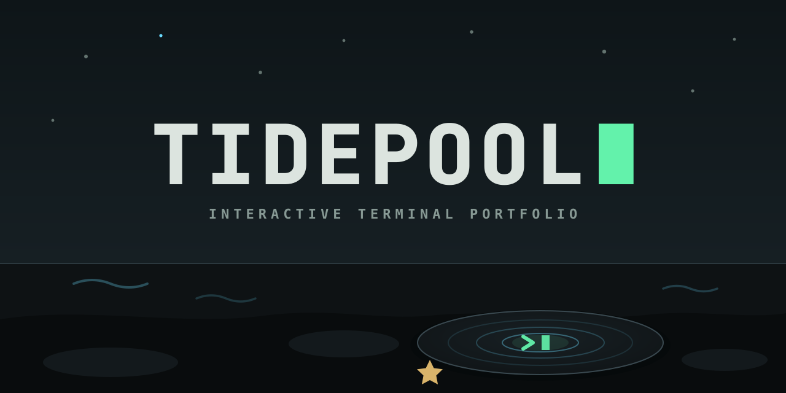

<div align="center">

  

  **An interactive terminal portfolio built with xterm.js — every page in the site is a shell command.**

  [](LICENSE)
  [](CHANGELOG.md)
  [](https://xtermjs.org)

  [Live demo](https://real-fruit-snacks.github.io/Tidepool/) · [About page](https://real-fruit-snacks.github.io/Tidepool/docs/) · [Changelog](CHANGELOG.md) · [Report an issue](https://github.com/Real-Fruit-Snacks/Tidepool/issues)

</div>

---

## Overview

Tidepool is a terminal-first portfolio rendered with xterm.js — the same terminal engine VS Code uses. Instead of pages and navigation, visitors explore a developer profile through real shell commands: `help` for the catalog, `cat about.md` for the bio, `repos` for a live table of GitHub repositories. A virtual Unix filesystem, tab completion, command history, a boot animation, and permalink support make it feel like an actual shell rather than a gimmick.

GitHub data is fetched once a day by a GitHub Action and committed to `public/data/github.json`, so the frontend ships with zero API tokens and makes zero runtime API calls.

*A tidepool is the smallest pocket of ocean — small, contained, complete in itself. Fitting for a portfolio that is a whole tiny operating system in a browser tab.*

## Features

- **Virtual terminal** — a full xterm.js implementation with 24-bit ANSI color, 1000-line scrollback, and clickable links.
- **Fourteen core commands** — `help`, `ls`, `cd`, `cat`, `neofetch`, `repos`, and more, with aliases (`ls` / `dir` / `ll`) and a categorized `help` listing.
- **Virtual filesystem** — navigate directories and read files using standard Unix semantics (`~`, `-`, `..`).
- **Tab completion & history** — completes commands and file paths; arrow keys browse a 200-entry history persisted in localStorage.
- **Data automation** — a daily GitHub Action fetches repository data with the `gh` CLI and commits it to the repo, keeping the frontend free of tokens and runtime API calls.
- **Deep linking** — bookmarkable permalinks auto-run commands on page load (`#neofetch`, `#cat about.md`).
- **Catppuccin Mocha theming** — 24-bit truecolor palette throughout, with a boot animation on load.
- **Mobile-friendly** — touch keyboard toggle, tested across current Chrome, Firefox, Safari, and Edge.

## Getting started

### Try it online

Open the [live demo](https://real-fruit-snacks.github.io/Tidepool/) and type `help`.

### Run locally

**Requires Node.js 20 or newer.**

```bash
git clone https://github.com/Real-Fruit-Snacks/Tidepool.git
cd Tidepool
npm install
npm run dev        # development server, usually http://localhost:5173
```

For a production build:

```bash
npm run build
npm run preview
```

### Make it your own

1. Fork the repository and edit `src/content.js` with your own bio, resume, and skills.
2. Enable GitHub Pages for the fork (Settings → Pages → Source: **GitHub Actions**).
3. Push — the included `deploy.yml` workflow builds and deploys the site, and `update-github-data.yml` refreshes your GitHub data daily.

## Usage

Inside the running terminal, interact just like a standard shell:

```bash
visitor@real-fruit-snacks:~ $ help          # categorized command listing
visitor@real-fruit-snacks:~ $ neofetch      # system info with ASCII art
visitor@real-fruit-snacks:~ $ skills        # color-coded progress bars
visitor@real-fruit-snacks:~ $ repos         # GitHub repositories table
visitor@real-fruit-snacks:~ $ cd projects && ls -l
```

### Commands

| Command | Description |
| --- | --- |
| `help` · `?` | Categorized command listing |
| `clear` · `cls` | Clear the terminal |
| `history` | Numbered command history |
| `pwd` / `cd` / `ls` / `cat` | Navigate and read the virtual filesystem |
| `whoami` | Display current user |
| `about` / `contact` / `resume` / `skills` | Portfolio content |
| `repos` · `projects` | GitHub repositories table |
| `neofetch` · `fetch` | System info with ASCII art |

### Keyboard shortcuts

`Tab` completes commands and paths · `↑` / `↓` browse history · `Ctrl+C` cancels input · `Ctrl+L` clears the screen · `Ctrl+U` clears the line · `Home` / `End` jump within the line.

## Architecture

```
src/
├── main.js              Entry point
├── shell.js             Input handling, prompt, command execution
├── terminal.js          xterm.js setup with addons
├── filesystem.js        Virtual filesystem
├── content.js           Static content (about, resume, skills)
├── formatter.js         ANSI color, box drawing, tables
├── github.js            GitHub data loader
├── history.js           Command history with localStorage
├── autocomplete.js      Tab completion
├── boot.js              Boot animation
├── permalink.js         URL hash read/write
├── theme.js             Catppuccin Mocha palette
└── commands/            Per-command implementations + registry

public/data/
└── github.json          GitHub API data (updated daily by CI)

.github/workflows/
├── deploy.yml           Build and deploy to GitHub Pages
└── update-github-data.yml  Daily GitHub data fetch
```

- **No framework** — vanilla JavaScript bundled with Vite; xterm.js is the only runtime dependency.
- **Privacy** — no telemetry and no third-party services. GitHub data is baked in at build time; command history and theme live in localStorage on the visitor's device only.
- **CI-fed data** — the `repos` table and per-repository files under `~/projects/` are generated from `public/data/github.json`, refreshed daily by a scheduled Action.

## Contributing

Contributions are welcome — new commands, shell parser improvements, or bug fixes. Please read [CONTRIBUTING.md](CONTRIBUTING.md) and the [Code of Conduct](CODE_OF_CONDUCT.md) before opening a pull request.

## License

Released under the [MIT License](LICENSE).
